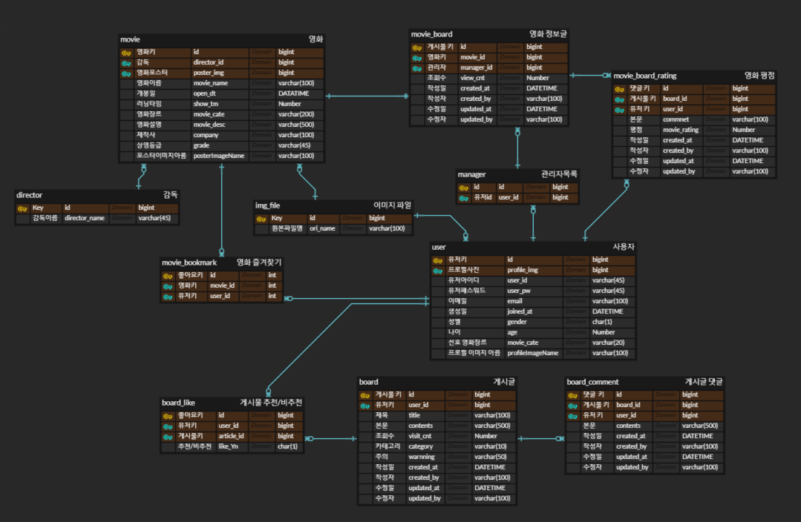
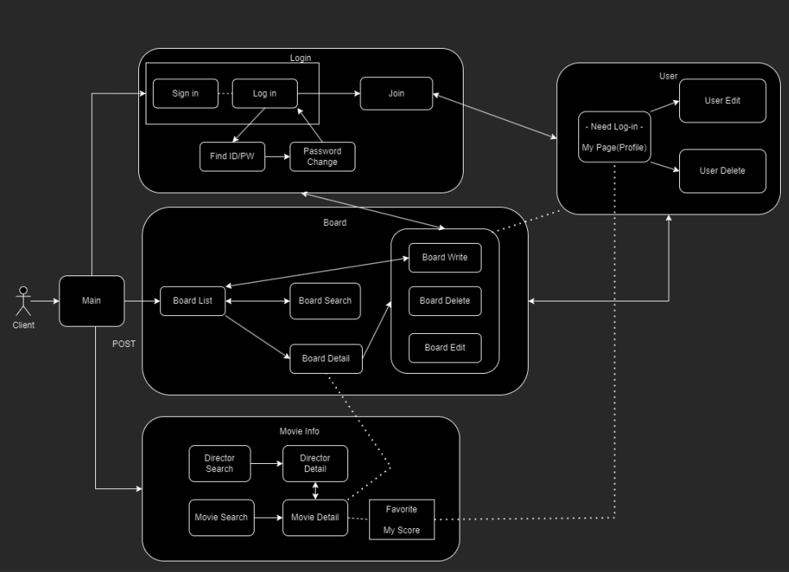

# movcom

# 프로젝트
> 개발기간 : 2024.07.19 ~ 2024.07.31

# 개발인원
> 5인

# 담당역할
> 기초 개발환경 세팅 및 배포 
> 회원가입, 로그인 기능 구현 
> 마이페이지 유저 관련 기능 구현 

# Skills
1. 백엔드
>

2. 프론트엔드
>

# ERD & USE-CASE

ERD

USE-CASE

# 주요기능
> 회원가입 및 로그인 
> 영화 리스트 확인 및 영화 정보 확인 
> 영화 즐겨찾기 추가, 평점 및 리뷰 댓글 작성 
> 자유게시판 글 목록 확인, 상세보기, 좋아요/싫어요, 댓글 작성 
> 마이페이지, 다른 유저 프로필 확인 
> 마이페이지에서 프로필 이미지 설정, 내 게시물, 댓글, 좋아요, 북마크한 영화 확인 
> 마이페이지에서 비밀번호 변경, 회원탈퇴 
